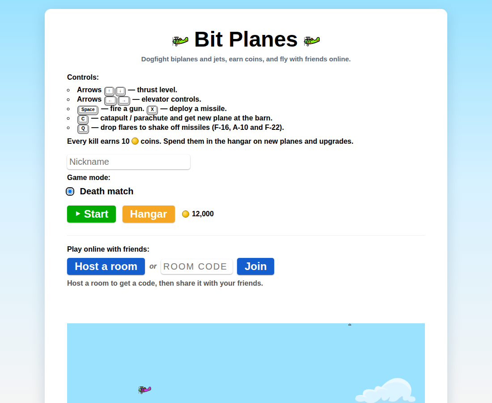
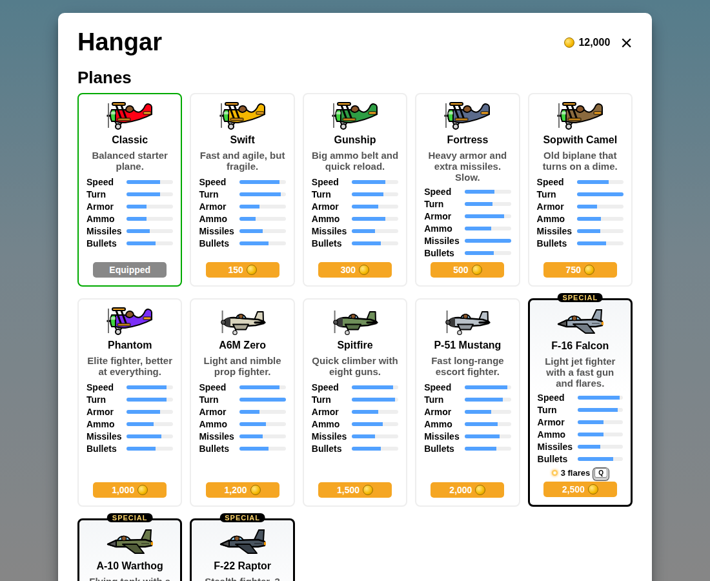
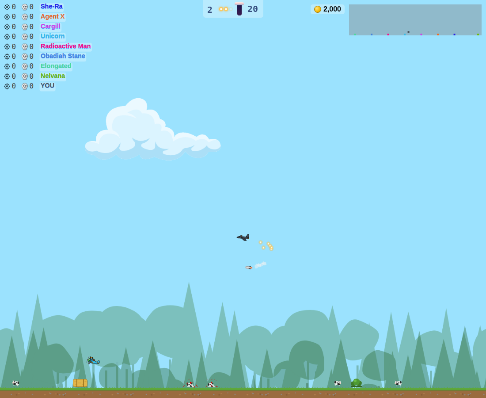

# ✈️ Bit Planes

A small browser dogfighting game. Fly biplanes, WWII fighters and jets, shoot
down computer pilots, earn coins, upgrade your plane and play with friends
online using a room code.



## Play

Open `index.html` through any static web server and press **Start**:

```sh
python3 -m http.server 8000
# then open http://localhost:8000
```

It also works on GitHub Pages as is. There is no build step.

### One-line version (loads from GitHub)

`play.html` is a single line: it loads the game from this GitHub repo through
the [jsDelivr](https://www.jsdelivr.com) CDN, so it always runs the latest code
on `main`. Save it anywhere (or paste this line into any page) and open it:

```html
<script src="https://cdn.jsdelivr.net/gh/aanzodev/bitplanes@main/js/loader.js"></script>
```

`js/loader.js` reads `index.html` from the same place and loads its page,
styles, scripts and images from there. jsDelivr caches files from a branch for
a while, so a new push can take some hours to show up.

## Controls

| Key | Action |
|---|---|
| <kbd>↑</kbd> <kbd>↓</kbd> | Thrust up / down |
| <kbd>←</kbd> <kbd>→</kbd> | Pitch (elevator) |
| <kbd>Space</kbd> | Fire the gun |
| <kbd>X</kbd> | Fire a missile |
| <kbd>Q</kbd> | Drop flares: missiles chase the flares instead of you (special jets only) |
| <kbd>C</kbd> | Eject / open parachute. Land at the barn for a new plane |
| <kbd>M</kbd> | Sound on / off (also the 🔊 button in game) |
| <kbd>Esc</kbd> | Menu (also the ⏸ button): resume, change plane, paint, leave to home. Pauses single player; online games keep running |
| <kbd>Ctrl</kbd>+<kbd>Shift</kbd>+<kbd>K</kbd> or <kbd>`</kbd> | Game console (see below) |

## Hangar

Every kill earns **10 coins**. Spend them in the **Hangar** on the start screen.



| Plane | Price | Notes |
|---|---:|---|
| Classic | free | Balanced starter biplane |
| Swift | 300 | Fast and agile, fewer bullets |
| Gunship | 600 | Big ammo belt, quick reload |
| Fortress | 1,000 | Heavy armor, extra missiles, slow |
| Sopwith Camel | 1,500 | Turns on a dime |
| Phantom | 2,000 | Better at everything (biplane) |
| A6M Zero | 2,500 | Light and nimble prop fighter |
| Spitfire | 3,000 | Quick climber, eight guns |
| Bf 109 | 3,500 | Fast climber, hard-hitting cannon |
| P-51 Mustang | 4,000 | Fast escort fighter |
| F4U Corsair | 5,000 | Tough navy fighter with rockets |
| **MiG-21 Fishbed** ★ | 7,000 | Cheap fast jet, 2 flares |
| **F-16 Falcon** ★ | 9,000 | Fast gun, 3 flares |
| **MiG-29 Fulcrum** ★ | 12,000 | Agile twin-engine jet |
| **A-10 Warthog** ★ | 15,000 | Flying tank, huge cannon belt |
| **F-15 Eagle** ★ | 20,000 | Powerful air superiority fighter |
| **Su-27 Flanker** ★ | 24,000 | Long range, turns hard |
| **F-35 Lightning** ★ | 30,000 | Stealth, second only to the Raptor |
| **F-22 Raptor** ★ | 40,000 | The best: 3 missiles, fastest bullets |

★ Special jets have a black border in the Hangar and carry flares: press
<kbd>Q</kbd> and missiles chasing you turn toward the flares and explode on them.

## Maps

Every game picks a random map (never the same one twice in a row):
Countryside, Desert, Arctic, Sunset and Night. Online, everyone who joins
plays on the host's map. Map art is in `assets/sprites/maps/` and the list is
in `js/maps.js`.

**Paint** any plane you own with one of 16 colors in the Hangar (free).

Upgrades (engine, handling, armor, ammo belt, reload, missile rack) apply to
whichever plane you fly. Coins and purchases are saved in your browser.

### Sound

Every plane has its own engine sound, synthesized live with the Web Audio API
(no audio files): each propeller plane has its own pitch, cylinder rhythm and
tone (the Spitfire and P-51 get a smooth Merlin growl, the P-51 its air-scoop
whistle, the Sopwith Camel a sputtering rotary). The special jets get turbine
roar and whine: F-16 with afterburner, the A-10's high "hair dryer" whistle and
GAU-8 *BRRRT*, the F-22's deep afterburner rumble. Guns, missiles, flares and
explosions from other planes get quieter and pan with distance. Tweak the
sounds in `js/audio/profiles.js`.

### Game console

Press <kbd>Ctrl</kbd>+<kbd>Shift</kbd>+<kbd>K</kbd> (or <kbd>`</kbd>; Firefox keeps
Ctrl+Shift+K for its own console) to open the built-in console and type
`help`. <kbd>↑</kbd>/<kbd>↓</kbd> go through history, <kbd>Tab</kbd> completes.

| Command | What it does |
|---|---|
| `coins`, `addcoins <n>`, `setcoins <n>` | Show / add / set coins |
| `planes`, `give <plane>`, `plane <plane>` | List planes, own one free, fly one you own |
| `paint <color>` | Paint your plane (`red`, `blue`, `factory`…) |
| `unlockall`, `reset` | Own everything / start over |
| `heal`, `refill`, `god` | Repair, reload, bullets can't shoot you down (single player) |
| `maps`, `map <map>` | List maps / switch map now (single player) |
| `mute`, `unmute`, `fps` | Sound off/on, FPS counter |
| `room`, `ping` | Online room code, your ping |
| `js <code>` | Run JavaScript |

### Test commands

Open the browser console (F12) on the game page:

| Command | What it does |
|---|---|
| `addCoins(1000)` | Add coins |
| `setCoins(10000)` | Set your coins to an exact amount |
| `unlockAll()` | Own every plane and max every upgrade |
| `resetShop()` | Back to 0 coins and the Classic plane |

Or add `?coins=10000` to the page URL to add coins once.

## Online play



1. One player presses **Host a room**. A death match starts and a 5 character
   room code appears at the top of the screen.
2. Friends type the code under **Play online with friends** and press **Join**.
   They can join at any time during the match.

Everyone flies their own plane and upgrades, and kills earn coins for whoever
made them. Players who join see their ping to the host under the room code
(the host runs the game, so it has no ping). Green is under 80 ms, yellow
under 160 ms, red above. The host's browser runs the game, so the host should have the best
connection. Each guest flies their own plane in their own browser, so turning,
thrust and bullets react instantly; the host decides hits and deaths. If the host closes the page the room ends.

Players connect directly to each other (WebRTC via [PeerJS](https://peerjs.com)).
The free PeerJS cloud server is only used to find each other. To use your own
server instead (for example on a local network), run a
[PeerJS server](https://github.com/peers/peerjs-server) and add
`?peerhost=<ip>&peerport=9000` to the URL for everyone.

## Project layout

```
index.html              Start screen, HUD and script tags
css/
  base.css              Page, buttons, keys
  menu.css              Start screen
  hangar.css            Hangar shop
  online.css            Online play
  game.css              In-game HUD
  pause.css             In-game menu
js/
  quality.js            Lowers render resolution when frames get slow
  pause.js              In-game menu (Esc): resume, plane, paint, leave
  console.js            Built-in console (Ctrl+Shift+K)
  maps.js               Maps (random each game)
  audio/
    profiles.js         How each plane sounds (edit to tweak)
    sound.js            Synthesized engine, guns, missiles, flares, explosions
  shop/
    catalog.js          Planes and upgrades for sale (edit prices/stats here)
    shop.js             Coins, purchases, applying a plane in game
    hangar.js           The Hangar screen
  online/
    common.js           Settings and helpers
    sync.js             Turning game objects into network messages
    host.js             Hosting a room
    guest.js            Joining a room
    prediction.js       Guests fly their own plane locally (no input lag)
    lobby.js            Host / Join buttons
  engine/               The game itself, one module per file
    registry.js         Modules register here…
    00-vector.js …      …vector math, constants, sprites, plane, missile,
    87-main.js          controls, physics, rendering, AI, game modes…
    assets.js           Sprite file paths
    boot.js             …and boot.js starts the game
  vendor/peerjs.min.js
assets/
  sprites/              Game sprites (units, effects, scenery, ui)
  icons/                HUD and logo icons
docs/screenshots/       Images for this README
```

The engine files come from the original minified webpack build of
[antonmedv/bit-planes](https://github.com/antonmedv/bit-planes), split into
modules and formatted, so variable names are short. Each file starts with a
comment saying what it does.
